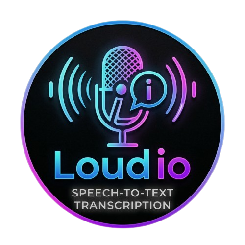

<p align="center">
  
</p>

# Loudio

**Offline Transcription Studio for macOS (Apple Silicon-first)**  
Loudio is a desktop app built with **Tauri + Next.js** for fast, local transcription of both audio files and microphone recordings.

## Why Loudio

Loudio is designed for users who want:
- Local/offline transcription workflows (privacy-friendly)
- A desktop-native experience (menu actions, shortcuts, packaging)
- Reliable microphone-to-text conversion with runtime checks and fallback behavior

## Highlights

- 🎙️ **Microphone recording + auto-transcribe on stop**
- 📁 **Audio file transcription** (`mp3`, `wav`, `m4a`, `flac`, `aac`, `ogg`)
- ⚙️ **Runtime bootstrap checks** for ffmpeg / whisper runtimes
- 🧠 **Multiple runtime profiles** (whisper.cpp + Python Whisper compatibility)
- ✨ **Live progress updates** during runtime setup and transcription
- 📋 **Copy and Clear transcript controls**
- 🕒 **Optional timestamp output**
- 🧩 **Native desktop menu integration** (File/Edit/View/Window/Help)
- 🍎 **macOS packaging support** (`.app`, `.dmg`) with custom icons

## Tech Stack

- **Frontend:** Next.js 16 + React 19 + TypeScript
- **Desktop Runtime:** Tauri v2
- **Backend Engine:** Rust
- **Audio Conversion:** ffmpeg
- **Transcription Engines:** whisper.cpp and Python OpenAI Whisper

## Project Structure

```text
loudio/
├── app/                 # Next.js App Router UI
├── public/              # Static assets (including logo)
├── src-tauri/           # Tauri + Rust backend and desktop config
├── scripts/             # Utility scripts
└── memory-bank/         # Project documentation/state files
```

## Prerequisites

- **Node.js** 20+
- **Yarn** (project uses Yarn 4)
- **Rust toolchain** (stable)
- **Cargo**
- **macOS** recommended (primary target)

> Loudio can bootstrap some runtime dependencies automatically (for example via Homebrew), but having a working local environment is still recommended.

## Getting Started

### 1) Install dependencies

```bash
yarn install
```

### 2) Run web UI only (Next.js)

```bash
yarn dev
```

### 3) Run desktop app in development (Tauri)

```bash
yarn tauri:dev
```

## Build

### Build web bundle

```bash
yarn build
```

### Build desktop app package

```bash
yarn tauri:build
```

Outputs are generated under `src-tauri/target` (including macOS app/dmg artifacts when building on macOS).

## Available Scripts

From `package.json`:

- `yarn dev` — start Next.js dev server on port 3000
- `yarn build` — build Next.js app
- `yarn start` — run Next.js production server on port 3000
- `yarn lint` — run Next.js lint
- `yarn tauri:dev` — run Tauri desktop app in development
- `yarn tauri:build` — build Tauri desktop app packages

## Runtime Notes

Loudio checks and/or prepares:

- `ffmpeg` for audio normalization/conversion to WAV
- `whisper-cli` (whisper.cpp)
- Python whisper runtime in an app-local virtual environment (fallback compatibility path)

This improves reliability for real-world microphone transcription workflows.

## Validation

Recommended local checks:

```bash
npx tsc --noEmit
cargo check --manifest-path /Users/lexprotech/Documents/GitHub/loudio/src-tauri/Cargo.toml
```

## Troubleshooting

### Microphone conversion/transcription error
If you see an error similar to:

> Failed to convert microphone audio to wav with ffmpeg

try:
- Verifying `ffmpeg` is available in your PATH
- Running **Help → Run Runtime Bootstrap** inside the app
- Setting `LOUDIO_FFMPEG_PATH` if ffmpeg is installed in a non-standard location

## License

This project is licensed under the terms in the [LICENSE](./LICENSE) file.

## Author

Created by **Sudeepta Sarkar**.
